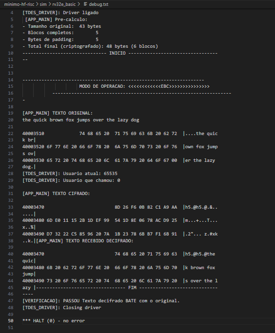
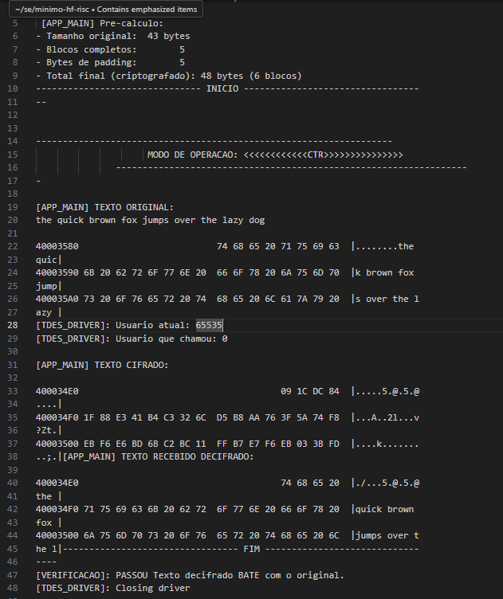
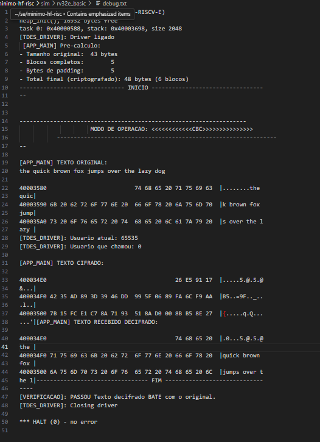

# 3DES MMIO Driver on RISC + UCX/OS

This project implements a **`Triple DES (3DES)`** encryption system in a minimal embedded stack, using:

- A **`VHDL IP core`** for the 3DES algorithm (RTL-level)
- A **`Memory-Mapped I/O (MMIO)`** interface to connect the crypto block to a custom SoC based on **HF-RISC**
- A **UCX/OS microkernel driver**, running on top of this simulated hardware platform

The work was developed using minimal versions of both [HF-RISC](https://github.com/sjohann81/hf-risc) and [UCX/OS](https://github.com/bbzaffari/ucx-os-minimo), provided by the course instructor, Prof. Sérgio Johann.

The driver enables encryption and decryption of arbitrary-length messages via system calls (`write()`, `read()`) and supports the following block cipher modes:

- **ECB (Electronic Codebook)**
- **CBC (Cipher Block Chaining)**
- **CTR (Counter Mode)**


The system includes padding (PKCS#7), task ID management, and validation using real text data, ensuring correct operation across the full encryption pipeline.

## Documentation
> For detailed electrical characteristics, communication protocols, and performance specifications, refer to the [***official datasheet***](/docs/3DESDatasheet_CoreTex_OpenCores.pdf)

## Table of Contents
- [Overview of this work](#overview-of-this-work)
- [Important files](#important-files)
- [Validation](#validation)
- [MMIO Register Interface for a 3DES VHDL IP Core](#mmio-register-interface-for-a-3des-vhdl-ip-core)
- [How to Set Up the Environment](#how-to-set-up-the-environment)
- [How to run](#how-to-run)


## Overview of this work

The objective of this work was to implement and validate a device driver for encryption based on the Triple DES (3DES) algorithm on the UCX/OS operating system, running on the HF-RISC-E processor. For this purpose, a 3DES cryptographic core described in hardware (VHDL) and mapped via MMIO on the SoC bus was used.

The application communicates with the driver through the standard calls write() (to encrypt or decrypt data) and read() (to retrieve the result). The driver implements task control, access permission verification by Task ID, and supports the ECB (Electronic Code Book) mode. Tests were conducted with real messages and padding management following the PKCS#7 standard.

Additionally, optimizations were made in the communication with the cryptographic IP, including checking the READY signal before reading the output, thus avoiding race conditions. The driver's structure allows modularity for future modes (CBC, CTR) and ensures data integrity in the encrypted input/output process. The main application was used to test the complete encryption and decryption pipeline, validating the correctness of the implemented algorithm.

## Important files:
* [minimal-HF-RISC-V/riscv/sim/tdes_tb.vhd](https://github.com/bbzaffari/minimal-HF-RISC-V/blob/6a5041a4e47189d85cda550ba80e718dcd1fe7e8/riscv/sim/tdes_tb.vhd) -> *HF-RISC-V System Testbench with Memory-Mapped 3DES Crypto Core and Peripheral Simulation*
* [minimal-HF-RISC-V/devices/controllers/tdes/*](https://github.com/bbzaffari/minimal-HF-RISC-V/tree/6a5041a4e47189d85cda550ba80e718dcd1fe7e8/devices/controllers/tdes) -> *RTL hardware description, provided by the vendor*
* [minimal-HF-RISC-V/sim/rv32e_basic/debug.txt](https://github.com/bbzaffari/minimal-HF-RISC-V/blob/6a5041a4e47189d85cda550ba80e718dcd1fe7e8/sim/rv32e_basic/debug.txt) -> *Debug*
* [ucx-os-minimo/app/tdes_driver/*](https://github.com/bbzaffari/ucx-os-minimo/tree/a263a33a0129bab2e1d8242ce02c7eee52ae085b/app/tdes_driver) -> *Tests applications & triple-DES driver using read and write interface*


## Validation:
The validation process was carried out using the hexdump function, which displays the binary content of a file in hexadecimal and ASCII format for low-level inspection.
The output (stdout) is saved in the [`debug.txt`](https://github.com/bbzaffari/minimal-HF-RISC-V/blob/6a5041a4e47189d85cda550ba80e718dcd1fe7e8/sim/rv32e_basic/debug.txt) file, accessible from this location.

---
---


# MMIO Register Interface for a VHDL 3DES

This project implements a bidirectional, **memory-mapped I/O** interface between a 3DES hardware encryption core, described in VHDL, and a RISC-V processor running firmware written in low-level C. The interface allows the CPU to configure control signals, load keys and plaintext blocks, and retrieve encrypted output — all through mapped addresses in the processor's memory space.

## Signal Mapping / RTL Bus Interface Logic for MMIO
##### The VHDL process that maps read/write operations to internal hardware signals

This pattern follows the classical ***`memory-mapped I/O`*** architecture, where:

- Software performs reads/writes to fixed memory addresses (via `volatile uint32_t*` in C).
- Hardware (VHDL) listens to those addresses and either:
  - **Latches** the written value into internal signals.
  - **Returns** current status or result values during a read.

This design decouples the processor from the internals of the crypto core, and provides a **clean interface contract** between the software and hardware domains.

[minimal-HF-RISC-V/riscv/sim/tdes_tb.vhd](https://github.com/bbzaffari/minimal-HF-RISC-V/blob/6a5041a4e47189d85cda550ba80e718dcd1fe7e8/riscv/sim/tdes_tb.vhd)

```vhdl
    -- 3DES Core
    data_read_des <= data_read_des_s(7 downto 0) & data_read_des_s(15 downto 8) & data_read_des_s(23 downto 16) & data_read_des_s(31 downto 24);
    ext_periph <= '1' when address(31 downto 24) = x"e7" else '0';
    
    -- Read Process: Maps 3DES outputs to processor's readable addresses
    process (clock_in, reset, address, data_out_des, function_select_des, reset_des, ldkey_des, lddata_des, out_ready_des)
    begin
        if reset = '1' then
            data_read_des_s <= (others => '0');
        elsif clock_in'event and clock_in = '1' then
            if (ext_periph = '1') then  -- 3DES at 0xe7000000
                case address(7 downto 4) is
                    when "0000" =>      -- Control Register Read: 0xe7000000
                                        -- Provides status of control signals, especially out_ready at bit 0
                        data_read_des_s <= x"000000" & "000" & function_select_des & reset_des & ldkey_des & lddata_des & out_ready_des;
                    
                    when "0001" =>      -- Not readable, write-only
                        data_read_des_s <= (others => '0');
                    when "0010" =>      -- Not readable, write-only
                        data_read_des_s <= (others => '0');
                    when "0011" =>      -- Not readable, write-only
                        data_read_des_s <= (others => '0');
                    when "0100" =>      -- Not readable, write-only
                        data_read_des_s <= (others => '0');
                    when "0101" =>      -- Not readable, write-only
                        data_read_des_s <= (others => '0');
                    when "0110" =>      -- Not readable, write-only
                        data_read_des_s <= (others => '0');
                    when "0111" =>      -- Not readable, write-only
                        data_read_des_s <= (others => '0');
                    when "1000" =>      -- Not readable, write-only
                        data_read_des_s <= (others => '0');
                        
                    when "1001" =>      -- Output Data Read [0]: 0xe7000090
                        data_read_des_s <= data_out_des(32 to 63);
                    when "1010" =>      -- Output Data Read [1]: 0xe70000A0
                        data_read_des_s <= data_out_des(0 to 31);
                    when others =>
                        data_read_des_s <= (others => '0');
                end case;
            end if;
        end if;
    end process;

    process (clock_in, reset)
    begin
        if reset = '1' then
            key1_in_des <= (others => '0');
            key2_in_des <= (others => '0');
            key3_in_des <= (others => '0');
            data_in_des <= (others => '0');
            function_select_des <= '0';
            reset_des <= '0';
            ldkey_des <= '0';
            lddata_des <= '0';
        elsif clock_in'event and clock_in = '1' then
            if (ext_periph = '1' and data_we /= "0000") then
                case address(7 downto 4) is
                    when "0000" =>
                         function_select_des <= data_write_periph(4);
                         reset_des <= data_write_periph(3);
                         ldkey_des <= data_write_periph(2);
                         lddata_des <= data_write_periph(1);
                         
                    when "0001" =>      --  0xe7000010
                        key1_in_des(32 to 63) <= data_write_periph;
                    when "0010" =>      --  0xe7000020
                        key1_in_des(0 to 31) <= data_write_periph;  
                        
                    when "0011" =>      --  0xe7000030
                        key2_in_des(32 to 63) <= data_write_periph;
                    when "0100" =>      -- 0xe7000040
                        key2_in_des(0 to 31) <= data_write_periph;
                        
                    when "0101" =>      -- 0xe7000050
                        key3_in_des(32 to 63) <= data_write_periph;
                    when "0110" =>      -- 0xe7000060
                        key3_in_des(0 to 31) <= data_write_periph;
                        
                    when "0111" =>      -- 0xe7000070
                        data_in_des(32 to 63) <= data_write_periph;
                    when "1000" =>      -- 0xe7000080
                        data_in_des(0 to 31) <= data_write_periph;
                    when others =>
                        NULL;
                end case;
            end if;
        end if;
    end process;
    
  
    crypto_core: entity work.tdes_top
    port map(   
        key1_in => key1_in_des,
        key2_in => key2_in_des,
        key3_in => key3_in_des,
        function_select => function_select_des, 
        data_in  => data_in_des,
        data_out => data_out_des,
        lddata => lddata_des,                   
        ldkey => ldkey_des,                    
        out_ready => out_ready_des,      
        reset => reset_des,                  
        clock => clock_in
    );
````
## Register Abstraction Layer for MMIO

This header file defines the **memory-mapped register interface** for a Triple DES (3DES) hardware crypto core. It allows a processor (e.g., RISC-V with UCX/OS) to interact with the hardware by reading and writing specific addresses corresponding to **control**, **keys**, **input data**, and **output ciphertext**.

The macros in this file represent physical register addresses, casted as `volatile uint32_t*`, to ensure **direct and safe hardware access**.

[ucx-os-minimo/app/tdes_driver/tdes_driver.c](https://github.com/bbzaffari/ucx-os-minimo/blob/1663f0fc2db87fe31ab12ee7b267204990797d60/app/tdes_driver/tdes_driver.c)

```c
#include <ucx.h>
#include <device.h>
#include "tdes_driver.h"

#define DES_BASE			0xe7000000
#define DES_CONTROL			(*(volatile uint32_t *)(DES_BASE + 0x000))
#define DES_KEY1_1			(*(volatile uint32_t *)(DES_BASE + 0x010))
#define DES_KEY1_2			(*(volatile uint32_t *)(DES_BASE + 0x020))
#define DES_KEY2_1			(*(volatile uint32_t *)(DES_BASE + 0x030))
#define DES_KEY2_2			(*(volatile uint32_t *)(DES_BASE + 0x040))
#define DES_KEY3_1			(*(volatile uint32_t *)(DES_BASE + 0x050))
#define DES_KEY3_2			(*(volatile uint32_t *)(DES_BASE + 0x060))
#define DES_IN0			    (*(volatile uint32_t *)(DES_BASE + 0x070))
#define DES_IN1			    (*(volatile uint32_t *)(DES_BASE + 0x080))
#define DES_OUT0			(*(volatile uint32_t *)(DES_BASE + 0x090))
#define DES_OUT1			(*(volatile uint32_t *)(DES_BASE + 0x0A0))

````

> *Implementation Details and MMIO Access in the uKernel-OS*:
> ***See [`🔗🔗🔗🔗🔗UCX README`](https://github.com/bbzaffari/ucx-os-minimo) for complete details — omitted here for clarity***

    What is MMIO?
    
---
---
# How to Set Up the Environment
- **In three steps:** ***`Clone -> Docker Setup-> Starting the container`***
  - [1st Clone](#1st-clone)
  - [2nd Docker Setup](#2nd-docker-setup)
     - [1. Docker pull the pre-built image](#1-docker-pull-the-pre-built-image)
     - [2. Run the Docker container](#2-run-the-docker-container)
  - [3rd — Starting/accessing the container](#3rd--startingaccessing-the-container)
  


## 1st Clone 

```bash
git clone --recurse https://github.com/bbzaffari/MMIO-tripleDes-VHDL-core
````

## 2nd Docker Setup

For the purposes of this class, the professor provided a pre-configured Docker environment that includes all the necessary dependencies for the system to run properly.
You can download and set it up using the following command:

### 1. Docker pull the pre-built image
```bash
docker pull ghcr.io/sjohann81/linux-es

````

###  2. Run the Docker container:

```bash
docker run -it --name SE -v "$PWD":/home ghcr.io/sjohann81/linux-es
```

* ***docker run*** **is more than just "starting a container." It’s a compound command that:**
   - 1. Creates a new container from the specified image (ghcr.io/sjohann81/linux-es) — this is like taking a blueprint (image) and building a working instance (container).
   - 2. Allocates resources like filesystem layers, network, and isolated namespaces.
   - 3. Configures the container with options like terminal interaction (-it), naming (--name), volume mounting (-v), and more.
   * 4. Runs the container by executing its default entrypoint (in this case, a shell environment).
   
* **`-it`**: Allocates an interactive terminal so you can use the command line inside the container.
* **`--name SE***`**: Names the container `SE`, which helps you reference it easily later.
* **`-v "$PWD":/home`**: Mounts your current working directory (from your host machine) into the container at the path `/home`.

> **Notes**:
> - ***1. After the first run, do not repeat the docker run command, or you'll create duplicate containers.***
>    * 1. This can lead to:
>    * 2. Confusion (multiple containers with similar configurations)
>    * 3. Conflicts over mounted volumes
>    * 4. Wasted disk space and dangling containers
> 
> * ***2. `$PWD` is an environment variable that returns your current working directory.***
>    * That directory **must contain the files you previously cloned** from the project repository.
>    * Inside the container, those files will be accessible at `/home`.


## 3rd — Starting/accessing the container 
**Accessing the Graphical Interface — *I do not recommend*** ❌
> By default, the container launches a lightweight graphical environment, which can be accessed via your browser at:
>  **[http://localhost:8080](http://localhost:8080)** 
> This interface provides a minimal desktop environment running inside the container.

**If you prefer to work directly via terminal or automation scripts, you can** ***safely skip the graphical interface***.
**To do so, press *`Ctrl + C`* in the current terminal to exit the graphical session, and proceed with the next step in the terminal.**

Once you've created the container using `docker run`, ***you don't need to recreate it again.***
Instead, follow these two simple commands to ***reuse*** the container:

#### 1. `docker start SE`
```bash
docker start SE
````
This command **starts an existing container** that has already been created earlier using `docker run`.

* `SE` is the name you assigned to the container when you first ran it.
* This command starts the container **in the background** — it doesn’t attach to its terminal.

#### 2. `docker exec -it SE bash`
```bash
docker exec -it SE bash
```
This command **attaches a terminal to the running container**, allowing you to interact with it just like you would with a regular Linux shell.

* `-it`: Opens an interactive terminal session.
* `SE`: Refers to the container you started.
* `bash`: Launches the Bash shell inside the container.

> - Use `start + exec` every time you want to return to the container after rebooting or closing Docker — **never `docker run` again** for this purpose.
> - Together, these two commands will bring you **back into your development environment** inside the container — ready to compile, run, and edit your project files that were mounted in `/home`.


---
---

# How to run:
- [ECB](#electronic-codebook-mode)
- [CTR](#ctr-counter-mode-encryption)
- [CBC](#cbc)
1. It is assumed that the files are located in the `/home` directory.
2. Sometimes `debug.txt` is automatically deleted, but simply running the command again resolves it.
3. Validation was performed using `debug.txt`, with output inspected via `hexdump`.


First, make sure the following tools are installed on your system:

```bash
apt update
apt install ghdl gtkwave
````

```bash
chmod +x home/run_model.sh
````

```bash
cd home/
````
## Electronic Codebook Mode

```bash 
./run_model.sh ECB
````
**Validation EBC** – *minimal-HF-RISC-V/sim/rv32e_basic/debug.txt*:




## CTR Counter Mode Encryption
```bash
./run_model.sh CTR
````
**Validation CTR** – *minimal-HF-RISC-V/sim/rv32e_basic/debug.txt*:



## CBC
```bash
./run_model.sh CBC
````
**Validation CBC** – *minimal-HF-RISC-V/sim/rv32e_basic/debug.txt*:



---
---


